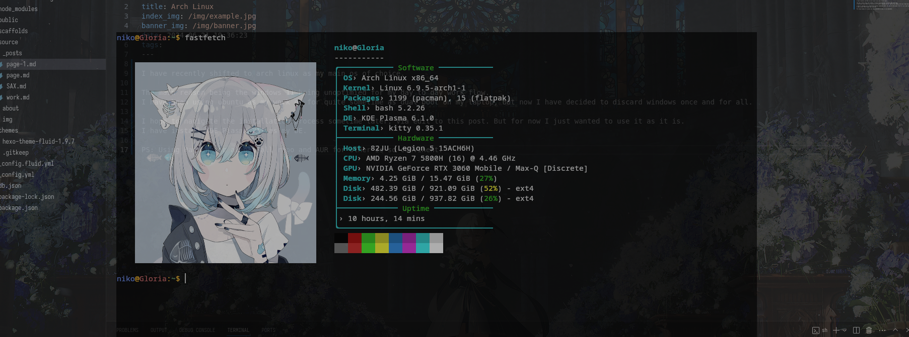

I have recently shifted to Arch Linux as my main OS of choice.

The primary reason for this change is that Windows 11 was not optimised for my day-to-day workflow. Previously, I had been using Ubuntu as a dual-boot option on my laptop for quite some time, but now I've decided to discard Windows altogether.

 For now, I've installed KDE Plasma X11 as my desktop environment.

PS: AUR nice!

